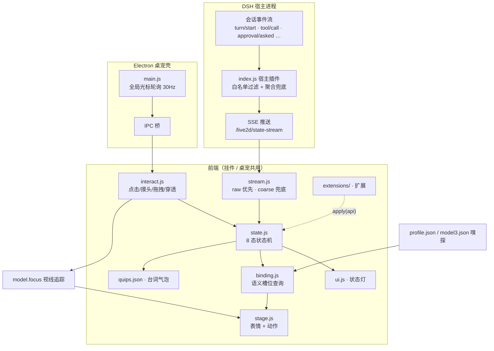

# Live2D 监控面板・看板娘桌宠（dsh-live2d-companion）

[DeepSeek Harness](https://github.com/deepseek-ai/dsh)（下称 DSH）的 Live2D 状态监控面板：让一只 Live2D 小人住进你的 DSH Web GUI，实时反映 AI 的工作状态——思考时歪头、工作时兴奋、等你确认时招手、闲着没事会打瞌睡。

**双形态**：网页右下角挂件 / Windows 桌面桌宠（Electron 透明置顶窗口），同一份前端内核驱动。

## 特性

- 🎭 **AI 状态同步**：订阅 DSH 会话事件流，7 态状态机（空闲/思考/工作/等待确认/报错/完成/睡眠）+ 左上角**状态灯**（8 色小灯+文字常显，含离线检测）
- 🖱️ **丰富交互**：点击反应、双击卖萌、摸头害羞、拖拽搬家、滚轮缩放、**全局视线跟随**（OS 层轮询光标，整屏追踪不限窗口）
- 💬 **气泡台词**：15 个台词池 70+ 条，状态轮播、时段问候、加班焦虑、深夜关怀
- ⚙️ **全配置化**：台词/节奏/行为阈值都在 `quips.json`，前端 30 秒热重载，改完即生效
- 🐾 **桌面桌宠**：透明无边框置顶、鼠标穿透（不挡操作）、位置记忆、随 DSH 启停（心跳看门狗）
- 🧩 **多模型**：任何 Cubism 4/5 模型丢进 `model/` 目录即可接入；语义槽位 + 自动嗅探 + profile.json 绑定层，情绪表现零配置自适应
- 🔌 **零侵入**：对 DSH 本体零修改，纯用户级 cordis patch 层挂载，DSH 升级免疫

## 架构

```
dsh 宿主进程
 └─ cordis patch 层（cordis.patch.yml insert 行）
     └─ index.js（宿主插件）
         ├─ prefix 路由 /live2d/*        → 静态资源（前端/模型/vendor）
         ├─ SSE  /live2d/state-stream    → session/event 白名单转发 + 聚合状态兜底
         ├─ exact /live2d/state|config   → 状态快照 / 模型配置
         ├─ tapIndex 注入 <script>       → 网页挂件（widget: false 可关）
         └─ spawn Electron 桌宠          → 随宿主启停（pet: false 可关）

浏览器挂件 / Electron 桌宠
 └─ boot.js（ES Module 入口装配）+ src/ 职能模块：
     ├─ config.js    → 环境常量 / localStorage / 台词库加载
     ├─ binding.js   → 语义槽位绑定（profile 覆盖 + model3.json 嗅探）
     ├─ ui.js        → 容器 / 气泡 / 状态灯
     ├─ stage.js     → PIXI 渲染 / 模型加载 / 布局收身 / 缩放
     ├─ state.js     → 8 态状态机（灯 + 表情 + 动作 + 台词轮播）
     ├─ interact.js  → 点击/摸头/拖拽/缩放/穿透/全局视线
     └─ stream.js    → SSE 客户端（raw 优先 / coarse 兜底 / 离线检测）
         └─ pixi.js + pixi-live2d-display + Live2D Cubism Core
```

宿主只转发白名单原始事件（`turn/start`、`tool/call`、`approval/asked`……），状态判定全在前端——调行为不需要重启宿主。前端模块间不互相 import，经共享上下文 `ctx` 在运行期取用彼此能力，依赖方向即 `boot.js` 的初始化顺序。

### 工作流程



## 安装

> 需要：已安装 DSH（`dsh web` 可用）、Node.js ≥ 18。

**1. 一键安装（官方插件通道）**

```powershell
dsh plugin --profile web add github:Tisitan/dsh-live2d-companion
```

本插件声明了 `dsh.bundle` 清单，`dsh plugin add` 会自动登记为 profile 组合层，无需手动接线。

**2.（可选）调整开关**

默认网页挂件开、桌宠关。要改就在 `$env:USERPROFILE\.dsh\profiles\web\cordis.patch.yml` 追加同 id 覆盖行：

```yaml
- insert:
    - id: live2d-companion
      name: 'dsh-live2d-companion'
      config:
        widget: false  # 关闭网页挂件
        pet: true      # 桌面桌宠随 DSH 自启
```

patch 文件热重载，保存即生效。

**开发者路径**：`git clone` 后 junction 到 `<DSH_HOME>\profiles\web\node_modules\dsh-live2d-companion`，再按上方注册 patch 行。

**3. 放入模型**

```
public/model/<模型名>/xxx.model3.json   ← 连同贴图、 motions、expressions 整目录放入
```

然后在 patch config 里指认：`model: '<模型名>/xxx.model3.json'`（默认 `nori/ARGNori.model3.json`）。

> 📦 **模型获取**：本仓库不分发任何模型文件。默认适配的 Nori 模型请前往 **I_NORI 群（1041616195）** 群文件自行获取；其他任何 Cubism 4/5 模型也可直接放入使用。

**4. 下载 Cubism Core（许可要求，仓库不含）**

从 Live2D 官方下载并放入：

```
public/vendor/live2dcubismcore.min.js
# 官方地址：https://cubism.live2d.com/sdk-web/cubismcore/live2dcubismcore.min.js
```

**5.（桌宠）安装 Electron**

```powershell
cd pet
npm.cmd install
```

重启 DSH Web（或下次启动时），桌宠自动出现。

## 配置

### patch config（`cordis.patch.yml`）

| 键 | 默认 | 说明 |
|---|---|---|
| `model` | `nori/ARGNori.model3.json` | 模型路径（相对 `public/model/`） |
| `widget` | `true` | 是否向 DSH 页面注入网页挂件 |
| `pet` | `false` | 是否随 DSH 自动拉起桌面桌宠 |
| `petDir` | `./pet` | Electron 壳目录 |

### quips.json（前端热重载，30 秒内生效）

| 区 | 说明 |
|---|---|
| `rotation` | 台词节奏：`holdMs`（单句停留）/ `intervalMs`（轮换间隔）/ `doneHoldMs` |
| `behavior` | 行为阈值：`sleepAfterMs`（闲置入睡）/ `seriousAfterMs`（加班严肃脸）/ `overtimeAfterMs`（加班焦虑） |
| `pools` | 15 个台词池：`thinking`/`working`/`done`/`waiting`/`error`/`overtime`/`sleeping`/`click`/`pat`/`drag`/`greet`/`greet_morning`/`greet_night`/`idle`/`busy` |

模型切换也可以不改配置：URL 加 `?model=<模型名>/xxx.model3.json` 临时指定。

## 自带模型与绑定层

本插件**与模型解耦**：状态机驱动的是「语义槽位」，模型素材通过两级机制绑定到槽位上——

### 第一级：自动嗅探（零配置）

启动时前端会拉取模型的 `.model3.json`，解析 `FileReferences` 里的表情/动作清单，按关键词模糊匹配槽位（如文件名含 `shy`/`害羞` → 害羞位，含 `nod` → 点头位）。任何命名规范的 Cubism 模型丢进来即可获得完整情绪表现；匹配不到的槽位**静默跳过**，不会报错。

### 第二级：profile.json 精确覆盖（可选）

在模型目录放 `profile.json`（`model/<模型名>/profile.json`，随模型一起走），逐槽位钉死映射；写了的槽位覆盖嗅探结果，没写的继续走嗅探。

**表情槽位**（值为模型里的表情名）：

| 槽位 | 用途 |
|---|---|
| `default` / `happy` / `excited` | 常态 / 完成 / 工作兴奋 |
| `shy` | 摸头、被拖动 |
| `doubt` | 思考、待确认 |
| `troubled` / `serious` | 报错、加班焦虑 / 加班严肃 |
| `surprised` | 睡醒惊醒 |
| `dark` / `sleep` | 离线 / 打瞌睡 |

**动作槽位**（值为 `[动作组名, 组内序号]`）：

| 槽位 | 用途 |
|---|---|
| `think` / `excited` / `shake` | 思考姿势 / 工作动作 / 摇头求确认 |
| `dizzy` / `nod` | 报错转圈 / 完成点头 |
| `sleep` / `glitch` | 打瞌睡循环 / 报错特效 |
| `clickPool` | 点击反应随机池，二维数组 |

示例（Nori 模型的实际 profile）：

```json
{
  "expressions": {
    "default": "00_Default", "happy": "13_Happy", "excited": "01_KiraKira",
    "shy": "04_Shy", "doubt": "10_Doubt", "troubled": "09_Troubled",
    "serious": "12_Serious", "surprised": "14_Surprised",
    "dark": "05_Dark", "sleep": "Sleep"
  },
  "motions": {
    "think": ["Poses", 1], "excited": ["Reactions", 2], "shake": ["Reactions", 1],
    "dizzy": ["Reactions", 5], "nod": ["Reactions", 0],
    "sleep": ["Idle", 1], "glitch": ["Effects", 0],
    "clickPool": [["Reactions", 0], ["Reactions", 1], ["Reactions", 2]]
  }
}
```

调试时可在控制台看解析结果：`window.__l2d.binding`。

## 扩展开发（贡献者向）

无需改核心代码即可拓展功能：`public/extensions/` 下放一个 ES Module，在 `index.json` 清单里登记文件名，启动时自动加载。

```js
// public/extensions/my-feature.js
export default function apply(api) {
  api.on('enter', (next, prev) => { /* 状态切换钩子 */ })
  api.showBubble('咱的扩展上线啦', 3000)
}
```

```json
// public/extensions/index.json
["hourly-chime.js", "my-feature.js"]
```

**公共 API（`api`，即控制台里的 `window.__l2d`）**：

| 成员 | 说明 |
|---|---|
| `enter(state)` / `showBubble(text, ms)` | 切状态 / 冒气泡 |
| `on(event, fn)` | 订阅事件，返回退订函数 |
| `registerState(name, def)` | 注册/覆盖状态行为（expr/motion/pool/rotate/remotionMs/transientMs） |
| `registerLamp(name, spec)` | 注册/覆盖状态灯（color/label/anim；自定义动画需自注入 @keyframes） |
| `quip(pool)` | 从台词池抽一句 |
| `state` / `binding` / `model` / `bounds` / `gaze` | 实时只读状态 |
| `ctx` | 完整共享上下文（实验性，结构可能随版本调整） |

**事件**：`enter`（状态切换，`(next, prev)`）、`raw`（宿主原始会话事件，`(ev)`）、`ready`（初始化完成，`(api)`）。

**隔离保证**：单个扩展加载或钩子抛错只会打出一条 `console.error`，不影响本体与其他扩展。自带示例 `hourly-chime.js`（整点报时），从清单删名即停用。

## 状态 → 表现映射

| 状态 | 触发事件 | 表情/动作 | 台词池 |
|---|---|---|---|
| thinking | `turn/start` / `assistant/chunk` | 疑惑 + 思考姿势循环 | thinking |
| working | `tool/call` 等 | 兴奋 + 定期重放动作 | working |
| waiting | `approval/asked` | 疑惑 + 摇头求确认 | waiting |
| error | `llm/retry-started` | 困扰 + 转圈/概率 Glitch | error |
| done | `turn/end`（6 秒后回 idle） | 开心 + 点头 | done |
| sleeping | 空闲超时（前端计时） | Sleep + 打瞌睡循环 | sleeping |
| —（加班中） | working 超时升级 | 严肃脸 → 困扰脸 | overtime |

## 调试

- 桌宠 DevTools：`L2D_DEBUG=1` 启动后 `--remote-debugging-port 9222`，配合 `pet/cdp-probe.mjs`（CDP 注入探针）
- 页面控制台句柄：`window.__l2d`（model / 当前状态 / bounds / 手动 enter）
- 桌宠环境变量：`L2D_URL`（目标页面）、`L2D_MODEL`（临时模型）

## 许可

- 本仓库代码：MIT（见 LICENSE）
- **不包含** Live2D 模型与 `live2dcubismcore.min.js`：模型请自备并遵守其原许可（Nori 模型见上方「模型获取」，请遵守群文件的原始发布条款）；Cubism Core 受 [Live2D 专有协议](https://www.live2d.com/eula/live2d-software-license-agreement_en.html)约束，请从官方渠道下载
- 依赖：pixi.js（MIT）、pixi-live2d-display（MIT）、Electron（MIT）
